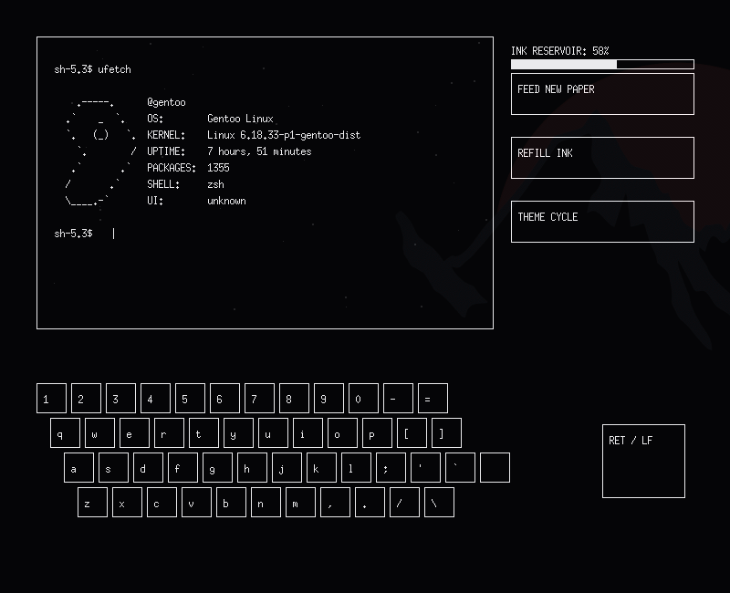
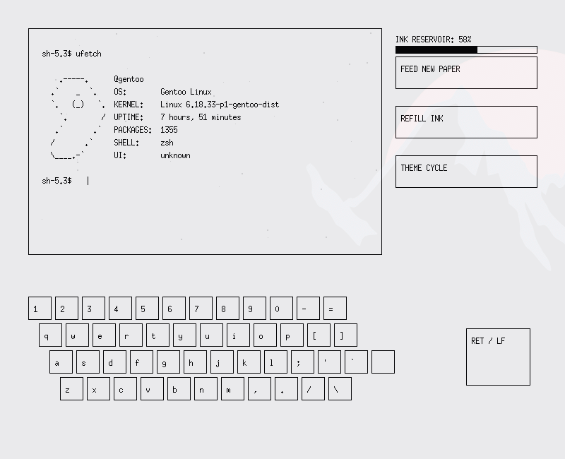
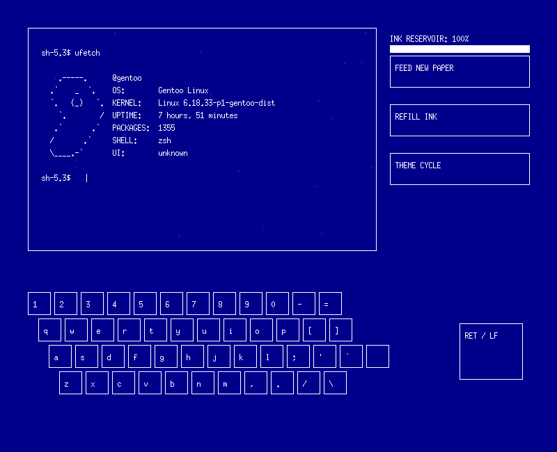
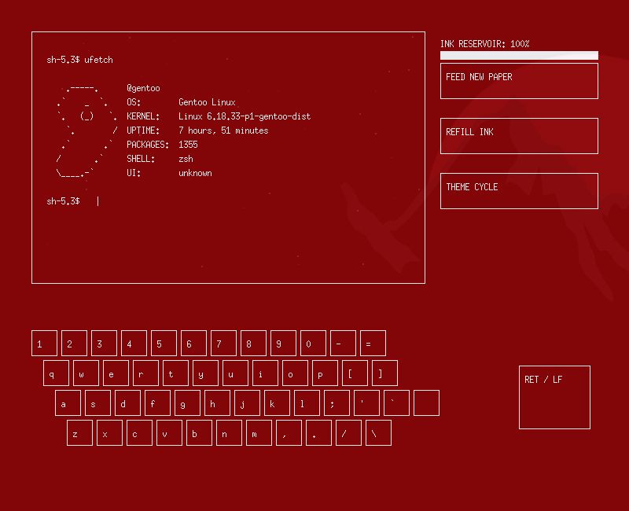
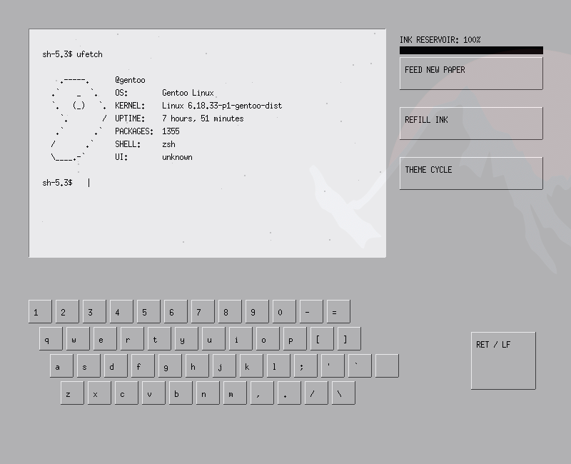

# itpwt — Ink Typewriter Terminal







## Description
A minimalist X11 and PTY-based terminal emulator designed to replicate the mechanics of a vintage mechanical typewriter. Interactive and fullscreen processes not supported.

## Features
* **Typewriter Simulation:** Letter-by-letter rendering with an animated mechanical hammer effect.
* **Consumable Mechanics:** Integrated simulated ink reservoir consumption and manual paper-feed cycles.
* **Interface Themes:** Multiple visual profiles, including monochromatic modes and win95 aesthetic.

## Requirements
* X11 development libraries (`libX11`)
* Standard POSIX pseudo-terminal utilities (`libutil`)
* A C99-compliant compiler (`gcc`)

## Compilation
To compile the source code, execute the following command in your terminal:

```bash
gcc -O2 itpwt.c -o itpwt -lX11 -lutil
